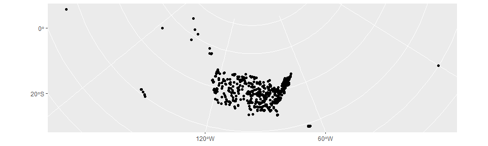
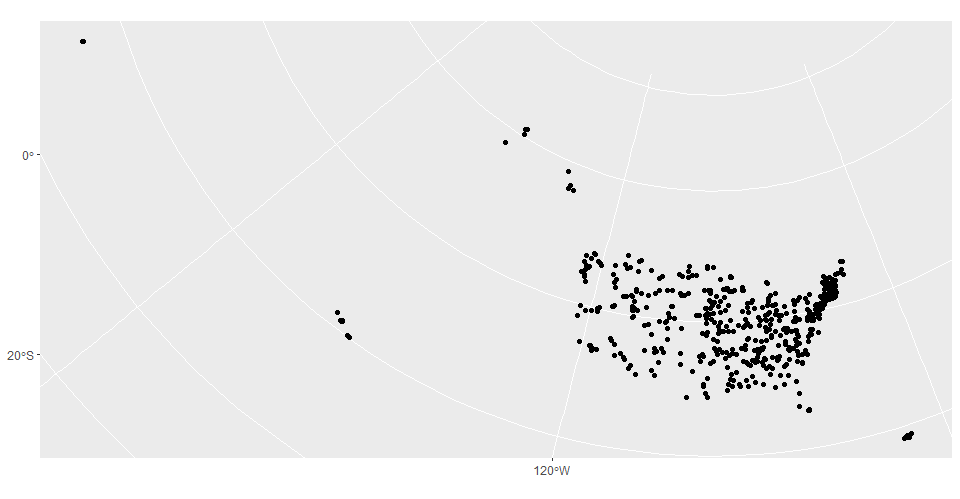

<!-- README.md is generated from README.Rmd. Please edit that file -->

# albersextra

<!-- badges: start -->

<!-- badges: end -->

The goal of albersextra is to include Puerto Rico, the Virgin Islands
and Guam in the traditional Albers maps. Also, albersextra will make it
easier to map line, point and other data in the Albers projection.

## Installation

You can install the development version from
[GitHub](https://github.com/) with:

``` r
# install.packages("devtools")
devtools::install_github("hlendway/albersextra")
```

## Example

This is a basic example which shows you how to solve a common problem:

``` r
library(albersextra)
## Pull in sample data for mapping
head(bridges) ## Data slice from National Bridge Inventory
#>   st_abbv rectype rtnum           strcture latitude longitude year
#> 1      AK       1 10808    NO DATA ENTERED  0.00000    0.0000 2008
#> 2      AK       1 00391    CHINIAK HIGHWAY 57.60400 -152.4055 1974
#> 3      AK       1 80007            8000700 55.79634 -131.6278 1999
#> 4      AK       1 00966 MENDENHALL LOOP RD 58.40417 -134.5847 1985
#> 5      AK       1 06590    NO DATA ENTERED 56.34885 -132.7188 2004
#> 6      AK       1 NSPCY       DIMOND DRIVE 61.17722 -149.8447 1978
#>   bridgecond          geometry
#> 1          F          NaN, NaN
#> 2          F -3422682, 4855940
#> 3          G -2309931, 4058852
#> 4          F -2384415, 4382488
#> 5          G -2355319, 4139464
#> 6          G -3090509, 5070914
```

``` r
# Map the dams sample data.
library(ggplot2)
ggplot() + geom_sf(data = dams) + coord_sf()
```



``` r
# Map the bridges sample data.
library(ggplot2)
ggplot() + geom_sf(data = bridges) + coord_sf()
```


