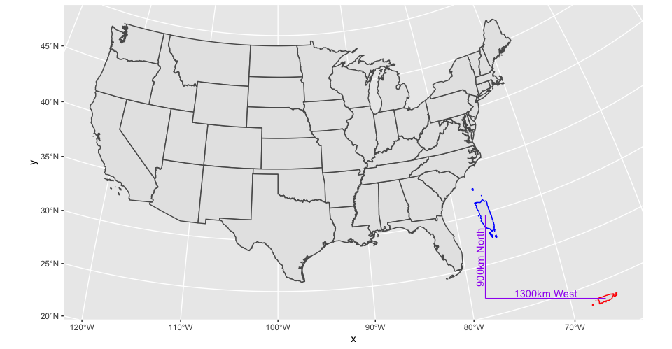
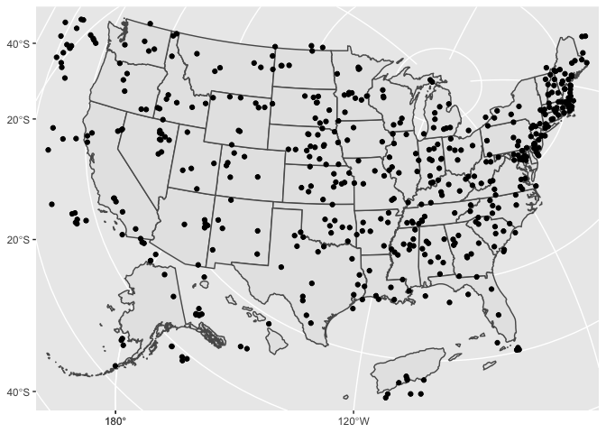

<!-- README.md is generated from README.Rmd. Please edit that file -->
ggcart <a href='https://uncoast-unconf.github.io/ggcart/'></a>
=====================================================================================================================================

<!-- badges: start -->
<!-- badges: end -->
The goal of ggcart is to include Puerto Rico, the Virgin Islands and Guam in the traditional Albers maps. Also, ggcart will make it easier to map line, point and other data in the Albers projection.

Installation
------------

You can install the development version from [GitHub](https://github.com/) with:

``` r
# install.packages("devtools")
devtools::install_github("uncoast-unconf/ggcart")
```

Examples
--------

Sample datasets include information from the National Inventory of Dams and the National Bridge Inventory.

``` r
library(ggcart)
## Pull in sample data for mapping
head(bridges) ## Data slice from National Bridge Inventory
#>   st_abbv rectype rtnum           strcture latitude longitude year
#> 1      AK       1 10808    NO DATA ENTERED  0.00000    0.0000 2008
#> 2      AK       1 00391    CHINIAK HIGHWAY 57.60400 -152.4055 1974
#> 3      AK       1 80007            8000700 55.79634 -131.6278 1999
#> 4      AK       1 00966 MENDENHALL LOOP RD 58.40417 -134.5847 1985
#> 5      AK       1 06590    NO DATA ENTERED 56.34885 -132.7188 2004
#> 6      AK       1 NSPCY       DIMOND DRIVE 61.17722 -149.8447 1978
#>   bridgecond          geometry
#> 1          F          NaN, NaN
#> 2          F -3422682, 4855940
#> 3          G -2309931, 4058852
#> 4          F -2384415, 4382488
#> 5          G -2355319, 4139464
#> 6          G -3090509, 5070914
```

The standard Albers conic projection isn't great for points in Alaska, Hawaii, Puerto Rico, Guam and the U.S. Virgin Islands. (AK and HI are taken care of with AlbersUSA. )

``` r
# Map the dams sample data.
library(ggplot2)
ggplot() + geom_sf(data = dams) + coord_sf()
```


``` r
# Map the bridges sample data.
library(ggplot2)
ggplot() + geom_sf(data = bridges) + coord_sf()
```


To convert your own set of point data with a latitude and longitude to an sf object, try the following:

``` r
# To convert your own point data for use with ggcart
bridges <- read_sf("data-raw/bridges.csv", ## Replace with your own csv file
                   options = c("X_POSSIBLE_NAMES=longitude",
                               "Y_POSSIBLE_NAMES=latitude"))
```

Demonstration on how the shift/rotate/scale functionality within the `transport_sf()` function works. For this example we will be shifting Puerto Rico by 1300km west and 900km north, then rotate 90 degrees, then scale to 2 times the size.

``` r
### Demonstration of how the shift functionality works -----------
pr_centroid <- sf::st_centroid(sf::st_geometry(ggcart:::puerto_rico))

# define shift dimension points for visual reference on map
pt1 <- pr_centroid
pt2 <- pr_centroid + 1000*c(-1300,0)
pt3 <- pr_centroid + 1000*c(-1300,900)
# Create into two lines (pt1-->pt2, pt2-->pt3) in sf object
pts <- sf::st_multilinestring(list(rbind(pt1[[1]][1:2], pt2[[1]][1:2]),
                                   rbind(pt2[[1]][1:2], pt3[[1]][1:2])))
pts <- sf::st_sfc(pts)
pts <- sf::st_set_crs(pts, sf::st_crs(pr_centroid))
# plot the shift/rotate/scale to Puerto Rico
ggplot()+
  geom_sf(data=ggcart:::lower48)+
  geom_sf(data=ggcart:::puerto_rico, color="red")+
  geom_sf(data=ggcart:::transport_sf(sf=ggcart:::puerto_rico,
                            scale=2,
                            shift = c(-1300,900)*1000,
                            rotate=pi/2), color="blue")+
  geom_sf(data=pts, color="purple")+ 
  annotate(geom="text",
           x=c(mean(c(pt1[[1]][1], pt2[[1]][1])),
               mean(c(pt2[[1]][1], pt3[[1]][1]))),
           y=c(mean(c(pt1[[1]][2], pt2[[1]][2])),
               mean(c(pt2[[1]][2], pt3[[1]][2]))),
           label=c("1300km West","900km North"),
           angle=c(0,90),
           color="purple",
           vjust=-.2)
```



Almost there!
-------------

`geom_sf_albersusa()` exists - but has some trouble...

(And is not documented, and it outputs some warning messages, and it ignores some territories...)

``` r
library(tigris)
#> Warning: package 'tigris' was built under R version 3.4.4
#> To enable 
#> caching of data, set `options(tigris_use_cache = TRUE)` in your R script or .Rprofile.
#> 
#> Attaching package: 'tigris'
#> The following object is masked from 'package:graphics':
#> 
#>     plot
library(rmapshaper)
#> Warning: package 'rmapshaper' was built under R version 3.4.4
library(sf)
#> Warning: package 'sf' was built under R version 3.4.4
#> Linking to GEOS 3.6.1, GDAL 2.1.3, PROJ 4.9.3
library(dplyr)
#> Warning: package 'dplyr' was built under R version 3.4.4
#> 
#> Attaching package: 'dplyr'
#> The following objects are masked from 'package:stats':
#> 
#>     filter, lag
#> The following objects are masked from 'package:base':
#> 
#>     intersect, setdiff, setequal, union
library(ggplot2)
library(ggcart)


capture.output({map <- states(cb = TRUE) %>%
  st_as_sf(map) %>%
  ms_simplify(keep = .05) %>%
  st_transform(
    "+proj=laea +lat_0=45 +lon_0=-100 +x_0=0 +y_0=0 +a=6370997 +b=6370997 +units=m +no_defs"
  )
})
#> Warning in strptime(x, fmt, tz = "GMT"): unknown timezone 'zone/tz/2018i.
#> 1.0/zoneinfo/America/Chicago'
#> [1] "\r  |                                                                       \r  |                                                                 |   0%\r  |                                                                       \r  |=                                                                |   1%\r  |                                                                       \r  |=                                                                |   2%\r  |                                                                       \r  |==                                                               |   3%\r  |                                                                       \r  |===                                                              |   4%\r  |                                                                       \r  |===                                                              |   5%\r  |                                                                       \r  |====                                                             |   6%\r  |                                                                       \r  |====                                                             |   7%\r  |                                                                       \r  |=====                                                            |   7%\r  |                                                                       \r  |=====                                                            |   8%\r  |                                                                       \r  |======                                                           |   9%\r  |                                                                       \r  |======                                                           |  10%\r  |                                                                       \r  |=======                                                          |  10%\r  |                                                                       \r  |=======                                                          |  11%\r  |                                                                       \r  |========                                                         |  12%\r  |                                                                       \r  |========                                                         |  13%\r  |                                                                       \r  |=========                                                        |  13%\r  |                                                                       \r  |=========                                                        |  14%\r  |                                                                       \r  |=========                                                        |  15%\r  |                                                                       \r  |==========                                                       |  15%\r  |                                                                       \r  |==========                                                       |  16%\r  |                                                                       \r  |===========                                                      |  16%\r  |                                                                       \r  |===========                                                      |  17%\r  |                                                                       \r  |============                                                     |  18%\r  |                                                                       \r  |============                                                     |  19%\r  |                                                                       \r  |=============                                                    |  19%\r  |                                                                       \r  |=============                                                    |  20%\r  |                                                                       \r  |=============                                                    |  21%\r  |                                                                       \r  |==============                                                   |  21%\r  |                                                                       \r  |==============                                                   |  22%\r  |                                                                       \r  |===============                                                  |  22%\r  |                                                                       \r  |===============                                                  |  23%\r  |                                                                       \r  |===============                                                  |  24%\r  |                                                                       \r  |================                                                 |  24%\r  |                                                                       \r  |================                                                 |  25%\r  |                                                                       \r  |=================                                                |  25%\r  |                                                                       \r  |=================                                                |  26%\r  |                                                                       \r  |=================                                                |  27%\r  |                                                                       \r  |==================                                               |  27%\r  |                                                                       \r  |==================                                               |  28%\r  |                                                                       \r  |===================                                              |  29%\r  |                                                                       \r  |===================                                              |  30%\r  |                                                                       \r  |====================                                             |  30%\r  |                                                                       \r  |====================                                             |  31%\r  |                                                                       \r  |====================                                             |  32%\r  |                                                                       \r  |=====================                                            |  32%\r  |                                                                       \r  |=====================                                            |  33%\r  |                                                                       \r  |======================                                           |  33%\r  |                                                                       \r  |======================                                           |  34%\r  |                                                                       \r  |=======================                                          |  35%\r  |                                                                       \r  |=======================                                          |  36%\r  |                                                                       \r  |========================                                         |  36%\r  |                                                                       \r  |========================                                         |  37%\r  |                                                                       \r  |========================                                         |  38%\r  |                                                                       \r  |=========================                                        |  38%\r  |                                                                       \r  |=========================                                        |  39%\r  |                                                                       \r  |==========================                                       |  39%\r  |                                                                       \r  |==========================                                       |  40%\r  |                                                                       \r  |==========================                                       |  41%\r  |                                                                       \r  |===========================                                      |  41%\r  |                                                                       \r  |===========================                                      |  42%\r  |                                                                       \r  |============================                                     |  43%\r  |                                                                       \r  |============================                                     |  44%\r  |                                                                       \r  |=============================                                    |  44%\r  |                                                                       \r  |=============================                                    |  45%\r  |                                                                       \r  |==============================                                   |  46%\r  |                                                                       \r  |==============================                                   |  47%\r  |                                                                       \r  |===============================                                  |  47%\r  |                                                                       \r  |===============================                                  |  48%\r  |                                                                       \r  |================================                                 |  49%\r  |                                                                       \r  |================================                                 |  50%\r  |                                                                       \r  |=================================                                |  50%\r  |                                                                       \r  |=================================                                |  51%\r  |                                                                       \r  |==================================                               |  52%\r  |                                                                       \r  |==================================                               |  53%\r  |                                                                       \r  |===================================                              |  53%\r  |                                                                       \r  |===================================                              |  54%\r  |                                                                       \r  |====================================                             |  55%\r  |                                                                       \r  |====================================                             |  56%\r  |                                                                       \r  |=====================================                            |  57%\r  |                                                                       \r  |======================================                           |  58%\r  |                                                                       \r  |======================================                           |  59%\r  |                                                                       \r  |=======================================                          |  59%\r  |                                                                       \r  |=======================================                          |  60%\r  |                                                                       \r  |========================================                         |  61%\r  |                                                                       \r  |========================================                         |  62%\r  |                                                                       \r  |=========================================                        |  63%\r  |                                                                       \r  |=========================================                        |  64%\r  |                                                                       \r  |==========================================                       |  64%\r  |                                                                       \r  |==========================================                       |  65%\r  |                                                                       \r  |===========================================                      |  66%\r  |                                                                       \r  |===========================================                      |  67%\r  |                                                                       \r  |============================================                     |  67%\r  |                                                                       \r  |============================================                     |  68%\r  |                                                                       \r  |=============================================                    |  69%\r  |                                                                       \r  |=============================================                    |  70%\r  |                                                                       \r  |==============================================                   |  70%\r  |                                                                       \r  |==============================================                   |  71%\r  |                                                                       \r  |===============================================                  |  72%\r  |                                                                       \r  |===============================================                  |  73%\r  |                                                                       \r  |================================================                 |  73%\r  |                                                                       \r  |================================================                 |  74%\r  |                                                                       \r  |=================================================                |  75%\r  |                                                                       \r  |=================================================                |  76%\r  |                                                                       \r  |==================================================               |  76%\r  |                                                                       \r  |==================================================               |  77%\r  |                                                                       \r  |==================================================               |  78%\r  |                                                                       \r  |===================================================              |  78%\r  |                                                                       \r  |===================================================              |  79%\r  |                                                                       \r  |====================================================             |  79%\r  |                                                                       \r  |====================================================             |  80%\r  |                                                                       \r  |====================================================             |  81%\r  |                                                                       \r  |=====================================================            |  81%\r  |                                                                       \r  |=====================================================            |  82%\r  |                                                                       \r  |======================================================           |  82%\r  |                                                                       \r  |======================================================           |  83%\r  |                                                                       \r  |======================================================           |  84%\r  |                                                                       \r  |=======================================================          |  84%\r  |                                                                       \r  |=======================================================          |  85%\r  |                                                                       \r  |========================================================         |  85%\r  |                                                                       \r  |========================================================         |  86%\r  |                                                                       \r  |========================================================         |  87%\r  |                                                                       \r  |=========================================================        |  87%\r  |                                                                       \r  |=========================================================        |  88%\r  |                                                                       \r  |==========================================================       |  88%\r  |                                                                       \r  |==========================================================       |  89%\r  |                                                                       \r  |==========================================================       |  90%\r  |                                                                       \r  |===========================================================      |  90%\r  |                                                                       \r  |===========================================================      |  91%\r  |                                                                       \r  |============================================================     |  92%\r  |                                                                       \r  |============================================================     |  93%\r  |                                                                       \r  |=============================================================    |  93%\r  |                                                                       \r  |=============================================================    |  94%\r  |                                                                       \r  |=============================================================    |  95%\r  |                                                                       \r  |==============================================================   |  95%\r  |                                                                       \r  |==============================================================   |  96%\r  |                                                                       \r  |===============================================================  |  96%\r  |                                                                       \r  |===============================================================  |  97%\r  |                                                                       \r  |================================================================ |  98%\r  |                                                                       \r  |================================================================ |  99%\r  |                                                                       \r  |=================================================================| 100%"
ggplot() + 
  ggcart:::geom_sf_albersusa(data = map, aes(geometry = st_geometry(map))) + 
  ggcart:::geom_sf_albersusa(data = bridges, aes(geometry = st_geometry(bridges)))
#> Warning: attribute variables are assumed to be spatially constant
#> throughout all geometries
#> Warning: attribute variables are assumed to be spatially constant
#> throughout all geometries
```


